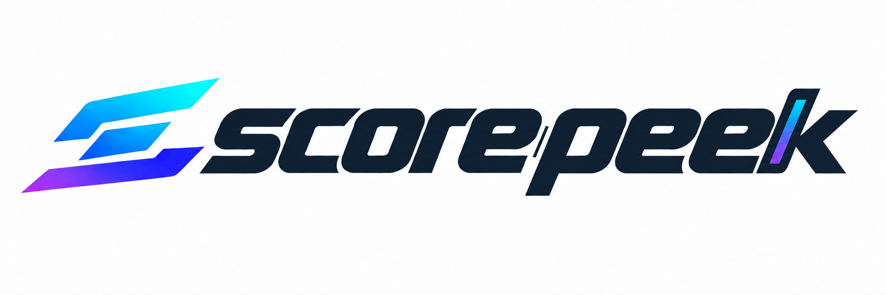
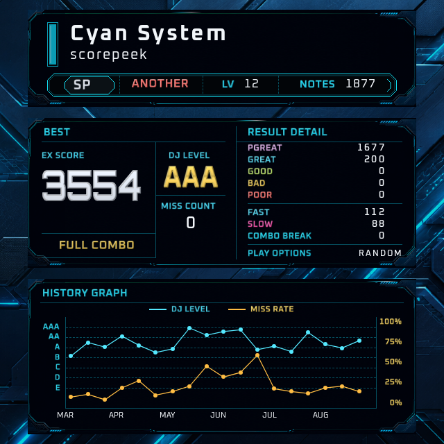
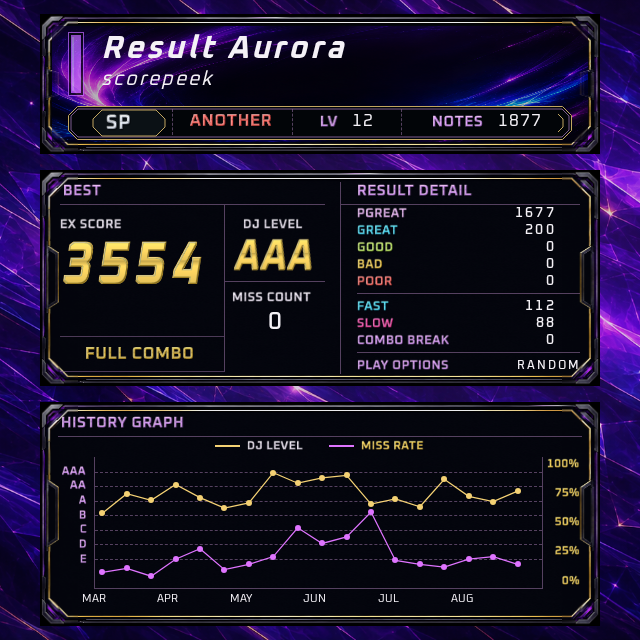
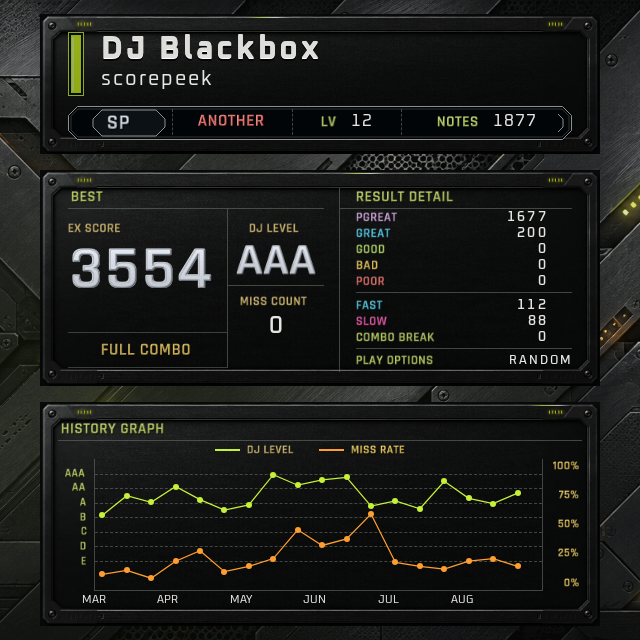

  <picture>
    <source media="(prefers-color-scheme: dark)" srcset="docs/assets/scorepeek-logo-dark.png">
    <source media="(prefers-color-scheme: light)" srcset="docs/assets/scorepeek-logo-light.png">
    
  </picture>

  An IIDX companion that automatically records your results and brings your progress into view.

| Cyan System | Result Aurora | DJ Blackbox |
| :---: | :---: | :---: |
|  |  |  |

> **NOTICE**
> Scorepeek is in active development. Published builds are early releases and
are not yet ready for general use.

## What you get

### Automatic score tracking

Keep a local record of your play results without entering scores by hand. See
your personal bests, recent results, history, and progress graphs in the overlay.

### Screen recognition that keeps up

Scorepeek reads your game screen using image recognition, without analyzing the
game's internal data. It matches OCR readings against song catalogs fetched
online. New songs do not need their own set of training images, reducing the
upkeep needed as the catalogs grow.

### Local processing, local records

Recognition runs on your machine, and your scores are saved locally. No cloud
OCR or screen uploads are needed to recognize and record your results.

### Build your own tools

The recognition core is separated from capture and presentation for portability
and reuse. Use the Event API for live recognition events and SQLite for recorded
scores and history to build your own dashboards, analysis tools, or integrations.
The included overlays are optional.

The core returns typed recognition and play decisions. The runtime projects
them into the versioned Event API and saves scores through the SQLite consumer.
The native overlay feed reads public events and committed history for both
Wayland and OBS; the browser client receives display state from its host.

### For your screen and your stream

Show an overlay on your own screen, in an OBS broadcast, or both. It is just as
useful for everyday play when you are not streaming.

### Make the overlay yours

Choose the information you want to see, move and resize widgets in the visual
editor, and decide which game screens show them. Install skins or create your
own; the three previews above are examples, not a fixed set of styles.

## Releases

GitHub Releases use `YYYY.M.COUNTER` CalVer, starting at counter `0` each month.
The release workflow checks for releasable commits every day at 04:17
Asia/Tokyo and can also be started manually; pushes to `main` do not release
immediately.
Each release contains a Linux x86-64 executable named
`scorepeek-VERSION-x86_64-unknown-linux-gnu`. Release automation verifies its
locally computed SHA-256 against the digest recorded by GitHub after upload.

## Third-party notices

Third-party source acknowledgements and terms are documented in
[`THIRD_PARTY_NOTICES.md`](THIRD_PARTY_NOTICES.md).

## Development validation

`mise run test` runs the repository checks, production asset builds, Clippy,
one standard `cargo nextest run --locked --workspace`, Vulkan layer artifact checks,
and the browser overlay test in fail-fast order. The browser test launches the
production `scorepeek` private OBS role with temporary HOME and XDG directories.
CI runs nextest with `--no-fail-fast` to report every Rust test failure in one run;
local `mise run test` retains nextest's default fail-fast behavior.
Private corpus replay, corpus import and review, skin preview generation,
native visual rendering, and nested Wayland require their
separate opt-in mise tasks. See [private corpus](docs/private-corpus.md) and
[overlay visual debugging](docs/overlay-visual-debugging.md).
