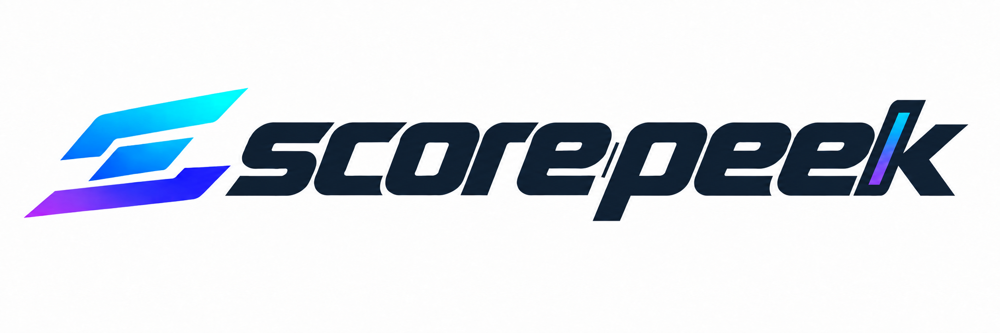

<p align="center">
  <picture>
    <source media="(prefers-color-scheme: dark)" srcset="docs/assets/scorepeek-logo-dark.png">
    <source media="(prefers-color-scheme: light)" srcset="docs/assets/scorepeek-logo-light.png">
    
  </picture>
</p>

<p align="center">
  An IIDX companion that automatically records your results and brings your progress into view.
</p>

## What you get

### Automatic score tracking

Keep a local record of your play results without entering scores by hand. See
your personal bests, recent results, history, and progress graphs in the
overlay. Score recording is on by default; `scorepeek run` stops with an error
if it cannot save results. Use `--no-scores` only when you want a run without
saved results.

Existing score databases migrate automatically on the next scored run. Before
changing an older database, Scorepeek creates a verified SQLite snapshot
beside it for manual recovery. Keep that snapshot until you have checked your
score history after upgrading.

### Screen recognition that keeps up

Scorepeek reads your game screen using image recognition, without analyzing
the game's internal data. It matches OCR readings against song catalogs
fetched online, so new songs do not each need their own training images.

### Local processing, local records

Recognition runs on your machine, and your scores are saved locally. No cloud
OCR or screen uploads are needed to recognize and record your results.

### Build your own tools

Use the Event API for live recognition events and SQLite for recorded scores
and history to build your own dashboards, analysis tools, or integrations.
The included overlays are optional.

### For your screen and your stream

Show an overlay on your own screen, in an OBS broadcast, or both. It is just
as useful for everyday play when you are not streaming.

### Make the overlay yours

Choose the information you want to see, move and resize widgets in the visual
editor, and decide which game screens show them. Install skins or create your
own. The `infinitas`
skin offers an INFINITAS-inspired glass-and-silver design. Its canvas `series`
property selects INFINITAS or an arcade-series palette from IIDX RED through
ZINRAI, keeping the layout and game meaning colors consistent.

## Install

Scorepeek currently distributes a Linux x86-64 executable. Download the
`scorepeek-VERSION-x86_64-unknown-linux-gnu` asset from the
[GitHub Releases page](https://github.com/atty303/scorepeek/releases), replacing
`VERSION` with the version in the release you choose. From the directory where
you downloaded it, install it as `scorepeek` on your `PATH`:

```sh
install -Dm755 scorepeek-VERSION-x86_64-unknown-linux-gnu "$HOME/.local/bin/scorepeek"
scorepeek --version
```

Replace `VERSION` in the command too, and ensure `~/.local/bin` is on your
`PATH`.

Run Scorepeek in a user session with an XDG runtime directory. The Vulkan
capture path needs a compatible Vulkan game. A fresh installation needs network
access to obtain the registered OCR model and song catalog. Wayland display
needs a Wayland session; OBS display needs OBS with a Browser Source.

## Start with Vulkan capture

1. Install the explicit Vulkan capture layer embedded in the executable:

   ```sh
   scorepeek vulkan-layer install
   ```

2. Enable the layer for the game process. A generic launch example is:

   ```sh
   env VK_INSTANCE_LAYERS=VK_LAYER_SCOREPEEK_capture GAME_COMMAND
   ```

   Replace `GAME_COMMAND` with the command that starts your game. The variable
   must reach the game process. If the game runs in a container, its environment
   and Scorepeek's `$XDG_RUNTIME_DIR/scorepeek` socket directory must both be
   accessible there.

3. In another terminal in the same user session, start Scorepeek:

   ```sh
   scorepeek run --capture vulkan-layer
   ```

   Scorepeek waits for an eligible game source; it does not launch the game.
   Score recording is on by default and requires a writable local SQLite
   database. Use `--no-scores` only if you intentionally want a run without
   saved results. Press Ctrl+C to stop the run.

### PipeWire alternative

If you already have a compatible PipeWire video source, use its exact
`node.name` instead of the Vulkan layer:

```sh
scorepeek run --capture pipewire --node-name NODE_NAME
```

Replace `NODE_NAME` with that source's name. Scorepeek does not choose or
switch capture sources automatically.

## Show the overlay

Overlays are off by default. Add either or both options to the `run` command:

```sh
scorepeek run --capture vulkan-layer --overlay-wayland-edit
```

`--overlay-wayland-edit` opens the Wayland overlay in edit mode. After setting
up a skin and canvas, use `--overlay-wayland` for normal display. For OBS, run:

```sh
scorepeek run --capture vulkan-layer --overlay-obs
```

Add a Browser Source in OBS with URL `http://127.0.0.1:3939/overlay` while
Scorepeek is running. Use the Browser Source's interaction view to edit the
layout. You can combine `--overlay-wayland` and `--overlay-obs` in one run.

A new overlay has no canvases. Install the `infinitas` skin from the same GitHub
Release as your executable, replacing `VERSION` with the version you chose:

```sh
scorepeek skin install https://github.com/atty303/scorepeek/releases/download/vVERSION/infinitas-2026-09-27.zip
```

Then add a canvas and widgets in the editor. The executable alone does not
populate an overlay layout. You can also install a downloaded skin ZIP with
`scorepeek skin install PATH_TO_SKIN.zip`.

## Check status

Use `scorepeek doctor` to check the local model, catalog, capture inventory,
and Vulkan layer installation. While a run is active,
`scorepeek diagnostic observe` streams diagnostic events. After it stops,
`scorepeek diagnostic inspect --latest` shows the most recent run. These
commands help distinguish setup problems from a game source that has not yet
appeared.

## Other commands

| Command group | Purpose |
| --- | --- |
| `config` | Locate, display, or check configuration. |
| `skin` | Install, list, or remove overlay skin ZIPs. |
| `vulkan-layer` | Install or remove the embedded Vulkan layer. |
| `completion` | Generate shell completion. |

Run `scorepeek --help` or `scorepeek COMMAND --help` for the full options and
subcommands.

## Third-party notices

Third-party source acknowledgements and terms are documented in
[`THIRD_PARTY_NOTICES.md`](THIRD_PARTY_NOTICES.md).
