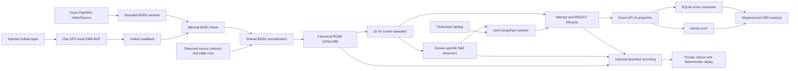

# Architecture

This document maps the current system, its data flow, and authority boundaries.
Detailed contracts live in the linked domain references and in the typed source
and tests that implement them.

## Data flow

## Runtime boundary

The installed `scorepeek` executable is provided by the binary-only `scorepeek-cli` package. It
classifies CLI requests into the transport-neutral `scorepeek-frontend-api` protocol and dispatches
them to the in-process Linux `scorepeek-runtime` service. Portable catalog, recognition, temporal,
and event authority lives in `scorepeek-core`; SQLite score persistence and queries live in
`scorepeek-scores`. The CLI owns terminal lifecycle and Ratatui
rendering; the runtime publishes only typed frontend snapshots and does not depend on a TUI toolkit.

The ordinary game-session process is Rust. It loads one active catalog, the
registered PP-OCRv6-small text bundle, the repository-registered numeric manifest and raw ONNX
embedded in the binary, and one explicitly selected capture backend before admitting recognition
work. Core owns shared bounded text and numeric OCR worker groups, their ORT sessions,
field prefetch and assembly, bounded parallel catalog scoring, and domain projection.
The pools are independent of session state; separate session handles share model workers
while keeping pending inputs and catalog binding isolated. Runtime owns whole-frame admission,
capture cadence, busy skips, and diagnostic transport. Corpus replay uses the same core field
engine with repository-registered resources, sharing one pool across active sessions.
OCR completion order and worker count do not set domain commit order. Python is restricted to
reproducible offline OCR preparation, training, and export tooling.

Catalog generation is not part of the distributed CLI. The separate
`scorepeek-catalog-publisher` workspace crate owns live-source acquisition,
source observation types and federation, SQLite snapshot writing and publication,
ZIP creation, publisher validation, and no-op selection. `scorepeek-core` owns
completed catalog types and validation, including the versioned `SourcePolicy`;
`scorepeek-resources` owns client ZIP verification, verified snapshot installation,
and catalog reading. GitHub
Actions publishes the selected three-file ZIP through the single Pages
workflow.

On first use, `scorepeek run` synchronously acquires and atomically activates
the effective catalog URL before capture starts. With a matching active URL it
starts immediately, keeps that exact SQLite digest for the entire invocation,
and starts a background update when the last successful check is at least 24
hours old or the previous check failed. A completed background activation is
used only by the next invocation. `SCOREPEEK_CATALOG_URL` overrides
`catalog.url` in `$XDG_CONFIG_HOME/scorepeek/config.toml`, which overrides the
built-in `/catalog/v1/catalog.zip` Pages URL registered in
`registration/catalog-url.txt`. HTTPS, loopback HTTP for tests,
and `file://` are accepted. Changing the effective URL requires successful
activation from the new URL and never falls back to the previous URL's active
catalog.

The offline Python project lives in `tools/ocr/`, including its source, tests,
`pyproject.toml`, `uv.lock`, and local `.venv`. Its `mise.toml` owns the pinned
Python and uv tools and the offline tasks. From the repository root, run
`mise run //tools/ocr:sync` to prepare the environment or
`mise run //tools/ocr:test` to test it; mise prepares missing tools when a task
runs. Other Python tasks use the same `//tools/ocr:` prefix, such as
`mise run //tools/ocr:title-model:prepare`. Tasks run in `tools/ocr/`, so relative
CLI paths are resolved there. Use absolute paths for private inputs and outputs.
The root `mise run test` and CI exclude the offline OCR tests. Shared model manifests
remain in `models/manifests/`, and Rust recognition and verification tasks remain
in the root configuration.

The runtime does not start, stop, signal, or restart the operator's ordinary
Gamescope, Steam, or game processes. It waits for exactly one eligible source,
treats each admitted producer lifetime as one capture
session, and performs bounded ordered teardown on source loss or process
termination.

Every supported Linux x86-64 Scorepeek binary embeds a stripped explicit Vulkan layer and its
relative-path manifest as one deflate ZIP. The separate `vulkan-layer install` operation publishes
the library and manifest into the user's fixed XDG data locations with same-filesystem atomic
renames; `uninstall` removes the manifest before the library. The run path never installs, updates,
or validates that payload. A connected development or previously installed layer is accepted by
the Vulkan capture protocol version alone, without a build identity or payload digest handshake.

## Capture and canonical frame

PipeWire and the Vulkan layer are opaque peer capture backends. PipeWire uses
the user's default remote and requires exactly one exact `node.name` with
`media.class=Video/Source`; it negotiates only progressive BGRx and
CPU-mappable buffers. The Vulkan producer allocates capture resources only
while Scorepeek is connected. Scorepeek requests at 10 Hz and imports one
GPU-local DMA-BUF, then performs a fenced readback on an asynchronous worker.
The consumer prefers a transfer-capable queue family without graphics capability, requests low
global queue priority when the device supports it, reuses a pre-recorded command buffer, and keeps
staging memory mapped for the session lifetime. These choices keep consumer readback off the
game's graphics queue when the device exposes an eligible family; diagnostics record the admitted
queue and separate producer, present-call, readback, and total latency distributions.
The producer-fence stage measures only fence wait remaining after `vkQueuePresentKHR` returns, so
the present-call and fence stages are non-overlapping.
CPU normalization also runs on a capture-owned worker before recognition. The
image is not reused before ACK; there is no frame ring, catch-up queue, or
external semaphore. A swapchain-maintenance present fence proves that the
presentation engine has released the layer's local chaining semaphore before
disconnect cleanup destroys it. The layer borrows an application-owned present fence when one is
already attached and tracks its reset or destruction without taking ownership; externally shareable
or imported fences fail capture because another handle can replace their payload. Otherwise the layer adds and
owns the fence. A supported PipeWire contract change drains the current
session and readmits the same node as a new session. Unsupported
contracts, invalid crops, import failures, and other terminal capture failures
finish diagnostics and terminate `scorepeek run` with an error.

For every admitted session, runtime records source backend, actual source contract,
memory type, stride, explicit edge crop, normalization method, canonical output
contract, and recognition resource revisions in structured diagnostics. Canonical
recording manifests carry only
the canonical input and its integrity, completion, and game-version facts. Public
events carry the capture session ID only. Invalid crop, format, memory, ambiguity, or source
contract fails closed; no backend or source fallback exists.

Only the admitted lease normalizer may create a contiguous canonical RGB8
1920x1080 frame. The capture lease rejects frames from another lease by ownership token.
Recognition accepts frames for its session ID and fixes layout, catalog, model, and
runtime revisions for the worker lifetime. Core borrows canonical pixels; capture
source evidence remains outside its recognition input.

## Recognition and temporal authority

The screen classifier creates typed TITLE, MUSIC SELECT, MODE SELECT,
DECIDE/transition, PLAY, RESULT, or UNKNOWN observations. TITLE is a session-local temporal
classification: at canonical 10 Hz, the upper-left `(16, 8, 280, 45)` ROI must have ten
consecutive bright-text bounding boxes within the registered layout bounds. The tenth frame starts
the TITLE episode; earlier candidate frames remain UNKNOWN. The predicate uses the bounding box,
not OCR text or bright-pixel count. Semantic screen episodes control suspension, drain, and
finalization. UNKNOWN never supplies field crops.

Screen-specific observers use scorepeek-owned layouts and registered model
bundles. Text recognition and specialist numeric recognition run in bounded
workers; one failed required field makes the whole screen observation fail
closed. Full-catalog song and chart resolution keeps title, artist, play type,
difficulty, level, and notes as independently attributable evidence. Ambiguity,
conflict, insufficient margin, or missing required evidence produces a typed
unknown rather than a guess.

After TITLE confirmation, its version crop enters the same bounded, screen-gated text-observer
path. A version is exactly 20 ASCII characters, with colons at byte offsets 3, 5, 7, and 9 and
ASCII alphanumerics elsewhere. Three equal valid observations on distinct source sequences identify
the session version; another valid value or an invalid observation breaks the consecutive run.
Identification disables further version OCR for that capture session. Version state never carries
between sessions.

MUSIC SELECT identity includes independently measured footer play side for SP and DP, selected chart
context, and its stability gate. RESULT independently stabilizes
left/right panel geometry before routing panel-local crops, while shared chart crops remain fixed.
Supplemental self-best values, RESULT recognition, and
play-attempt resolution have separate state. Supplemental best values never
become song-identity or attempt-acceptance evidence. Current field
applicability and acceptance rules are defined in
[field semantics](field-semantics.md).

## Events and score persistence

The public live interface is Event API v5 on
`$XDG_RUNTIME_DIR/scorepeek/events.sock`. A client receives one current
snapshot and then ordered NDJSON events. The public projection excludes raw
OCR, candidates, recognition metrics, recording paths, pixels, and stored
history. Its nullable session version becomes non-null only after identification and is not written
to the SQLite score history. Reconnection restores current state, not every missed event. The wire
contract and RESULT lifecycle are defined in [Event API v5](event-api.md).

The in-process `scorepeek-scores` consumer persists provisional, retracted,
and confirmed RESULT transitions plus current MUSIC SELECT supplements in
SQLite. Persistence is independent of socket clients and optional recording.
Overlays query committed SQLite state for score/history presentation; they do
not treat a live RESULT payload as committed history.

## Overlay boundary

Wayland and OBS are independent consumers of the same public event and SQLite
state. They share the Dioxus editor model, semantic presentation, installable
skin ABI, and canvas/widget document. Backend adapters own only transport,
surface lifecycle, input normalization, and rendering differences.
The portable `scorepeek-overlay` crate also serves the browser Wasm client.
`scorepeek-overlay-runtime` owns the shared native Event API feed and reconnection,
SQLite history projection, configuration storage, skin package storage, and ZIP
structure checks. The Wayland adapter owns native Wasmtime execution and
installation smoke validation; the browser client executes skins in a Web Worker.

Each installed skin is a self-contained ZIP with manifest, Wasm DOM producer,
CSS, preview, and package-relative resources. Native executes the Wasm module
through Wasmtime; OBS executes it in a Web Worker. The current authoring
contract is [skin plugin API v2](skin-plugin-api-v2.md).

An explicitly requested overlay is part of `scorepeek run` startup. The child must report ready
after its configured skins and backend-owned surfaces or listener initialize; a timeout or error
before that boundary fails the run. A worker or adapter failure after ready remains an overlay
diagnostic and does not terminate recognition.

An active Wayland surface presents once per compositor frame callback. An inactive canvas detaches
its buffer and suspends only the GPU presentation renderer while retaining the worker, Wayland shell,
DOM, and skin runtime. Reactivation restores the complete double-buffered layer state before its
bufferless remap commit, waits for the layer-shell configure, resumes the renderer, and presents the
already-retained skin tree. OBS expresses the same
active/inactive meaning by including or removing the canvas iframe from composition. Skin runtime
schedules drive Wasm/DOM updates independently of either backend's presentation mechanism.

Browser integration and fake Wayland are the routine overlay completion gates.
The checked-in nested compositor scenario is an opt-in host-dependent gate. Real OBS or a live
compositor is used when an adapter-specific failure needs investigation, not as
a standing gate for every editor or skin change. The reproducible procedures
are in [overlay visual debugging](overlay-visual-debugging.md).

## Diagnostics and private corpus

Every `run` writes one invocation-level structured diagnostic stream without changing recognition
or event authority. `--record` adds selectively retained canonical video but always elides TITLE
pixels; `--record-all` retains every canonical 10 Hz due tick, including TITLE. Both modes publish a
v5 canonical manifest with the final session version state and neither changes recognition or event authority. The separate live socket, 128 MiB ring,
disk degradation, and ten-generation policy are defined in [runtime diagnostics](diagnostics.md).

The private corpus imports a complete canonical recording directory read-only,
copies its verified segments into a local generation, and activates a regression
session only after a separate review apply operation. Its replay reads canonical
input, supplies canonical session start and finish boundaries plus the recorded
game-version state, and uses the core coordinator without a runtime crate or
diagnostic stream. Reviewed labels bind episode spans and stable screen anchors;
replay compares SELECT state and ordered confirmed RESULT values, including
score and judgments, directly with that reviewed truth. Result and Music Select
field replay selects the current source-registered catalog and OCR model into an
isolated temporary store.
Real frames, complete labels, generated catalogs, text-model bytes,
player data, and credentials stay outside Git. The registered v3 numeric ONNX is the explicitly
approved repository artifact. See [private corpus](private-corpus.md).

## Ownership

| Concern | Current owner |
| --- | --- |
| External source bytes and catalog generation | `scorepeek-catalog-publisher` in GitHub Actions |
| Pages packaging, validation, and no-op selection | `scorepeek-catalog-publisher` and `.github/workflows/catalog-pages.yml` |
| Client ZIP verification, content store, and activation | `scorepeek-resources` plus `scorepeek-runtime::resources::catalog` |
| PipeWire or Vulkan producer lifetime and frame reception | Capture provider and receiver |
| Runtime source identity, edge crop, and canonical normalization | Capture admission and session-start diagnostics |
| Canonical game coordinates | Versioned layout resources in `crates/scorepeek-core/src` |
| OCR preprocessing, models, and thresholds | Registered text bundle and embedded numeric model artifacts |
| Screen, song/chart, and attempt semantics | Recognition and temporal Rust modules |
| Public live compatibility | Event API v5 typed projection |
| Durable local score state | `scorepeek-scores` SQLite consumer |
| Portable canvas/editor state and skin ABI | `scorepeek-overlay` and `scorepeek-skin-sdk` |
| Native overlay feed, configuration, and skin storage | `scorepeek-overlay-runtime` |
| Native skin execution and DOM rendering | `scorepeek-overlay-wayland` |
| Private replay evidence | Canonical recording and external private corpus |

Git history owns superseded designs, experiments, rejected alternatives, and
point-in-time verification results. They are not additional runtime or design
authorities.
