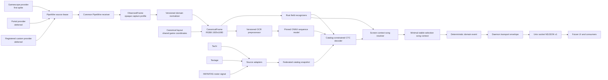

# Architecture

This document is a compact map of the intended system. The accepted delivery
sequence and release gates are authoritative in [the implementation plan](plan.ja.md).

## Data flow



## Stable boundaries

### Frame source

PipeWire source acquisition is separate from frame reception. A selected
provider acquires a lifetime-bound source lease containing its remote, exact
node or deterministic selector, capture profile, and provider-owned lifetime
guard. The common receiver owns stream negotiation, bounded latest-frame
handling, sequence/timing, and source-loss notification. Gamescope against the
default PipeWire remote is the first provider. Portal later supplies a
session-scoped remote FD and node ID through the same boundary; registered
custom providers may follow. No provider silently falls back to another.

Every backend produces an owned `ObservedFrame` containing its exact input
contract, capture generation, sequence number, monotonic timing, and immutable
opaque capture profile identifier. A versioned domain normalizer maps that
profile to an owned, contiguous RGB8 `CanonicalFrame` at exactly 1920x1080.
The canonical representation is the specified logical game canvas; it has no
required native, Portal, Gamescope, or OBS pixel reference. A capture profile
owns only observed input. Its normalizer artifact maps that profile to one
canonical frame contract. The canonical frame contract owns the shared game
layout; replay evidence references its immutable layout digest separately.

The normalizer treats its capture pipeline as one domain and does not model
Wine, Vulkan, Gamescope, compositor, PipeWire, or other layers separately.
Deterministic geometry, color, and filtering are preferred. A learned residual
adapter must be justified by measured recognition evidence, remain bounded and
deterministic, and never act as a generative text restorer.

Portal, Gamescope direct PipeWire, and any later eligible route remain peer
profiles selected by independent semantic, lifecycle, and target performance
gates. Sharing a PipeWire receiver does not make their observed pixels or
lifecycles equivalent. Each candidate has a distinct capture profile and
normalizer but does not own a layout. A running session never silently switches
providers or profiles, and reacquisition starts a new capture generation.

### Layout

One versioned canonical layout contains scorepeek-owned ROIs, presence
predicates, and alignment tolerances in logical game coordinates. Every
supported capture profile must normalize to that layout. The layout changes
only with the game UI geometry, canonical frame contract, or field contract;
capture-route changes create a new profile or normalizer instead. An upstream
implementation may inform where to investigate, but its code, coordinates,
resources, and derived data do not enter the layout or its generation process.
The initial layout may be measured from one exact profile only after its
versioned normalizer has produced canonical frames. That profile is calibration
evidence, not a pixel reference. Later peer profiles calibrate their own
normalizers to the same layout rather than creating route-local coordinates.

### Catalog federation

Source adapters turn immutable Tachi, Textage, and INFINITAS-roster snapshots
into typed observations with source revision, lineage, content digest, parser
version, field authority, and scope. They never execute downloaded JavaScript.

Federation uses exact source bindings and exact, multi-field evidence. It does
not use fuzzy identity merging, weighted majority, or source recency to settle
cross-source conflicts. Ambiguous records are quarantined independently while
safe additions extend the previous catalog. A content-addressed SQLite snapshot
is activated by atomically replacing a small manifest; source failure never
shrinks the last-known-good catalog. Scheduled and manual sync share one
per-host exclusive writer lock. Activation verifies that its base digest is
still current, fsyncs staged files and directories, renames the snapshot, and
fsyncs the content-store destination parent. Only then does it fsync and
atomically replace the active manifest and fsync the manifest parent before
releasing the lock.

Scheduling is an outer trigger for `scorepeek catalog sync`; it does not encode
how a catalog is acquired. The current implementation builds from validated
source observations on each host. If a later ADR and source permissions allow a
GitHub-managed catalog, the same command can expose a user-selected self-build
or immutable provided-catalog mode, while GitHub scheduling runs the self-build
orchestration before publication. Both modes must retain provenance, bounded
content-addressed storage, semantic validation, and last-known-good activation.

The daemon does not synchronize during a game session. It opens one immutable
catalog digest at startup.

### Recognition

The engine exposes pure frame inspection, catalog-constrained title decoding,
and a separate stateful session boundary:

```text
RecognitionEngine.inspect(frame) -> RecognitionSnapshot
TextObserver.observe(roi) -> TextObservation
ScreenSongResolver.resolve(observations, catalog, context) -> AcceptedSong | Rejected
RecognitionSession.process(snapshot) -> DomainEvent[]
```

The canonical frame preserves RGB information shared by all field recognizers.
Recognition constructors require the expected canonical-extraction digest and
validate the complete typed normalizer artifact, canonical extraction manifest,
frame bytes, and their digest bindings; a bare observed RGB frame is not
accepted even when its dimensions happen to be 1920x1080.
After layout-bound ROI extraction, OCR-specific grayscale, contrast, resize,
padding, and tensor normalization belong to a versioned OCR preprocessor bound
to the model. Training and Rust inference use the same preprocessing contract.

Fields are represented as `known`, `unknown(reason)`, or `not_applicable`.
PP-OCRv6 small native-dynamic is the selected v1 text observer for title and
artist; each field keeps its own ROI and preprocessing contract. OCR output is
an observation rather than an authoritative value. Frame-local full-catalog resolution keeps
screen-specific evidence separate. Result uses title and artist today; later result fields remain
explicitly unobserved. A deterministic post-resolver reducer stabilizes result song and clear type
after two equal observations within 250 ms, preserves stable values across a transient unknown, and
fails closed on a different accepted value. Music select uses central
title, artist, play mode, selected difficulty and level, and the active
right-list title. The two title presentations are not counted as independent
metadata votes, and readable conflict rejects; stable-selection dwell is still unimplemented.
Version participates only when it is independently recognized. Raw frame observations and derived
temporal transitions remain separate from future accepted domain events. Rejection is preferable
to a guess.

Python is an offline training/export dependency only. The game-session runtime
uses a pinned ONNX model in Rust and has no model or catalog network fallback.
Real captures, training labels, source snapshots, generated catalogs, and model
artifacts remain outside the repository.

Human-labelled captures from any supported profile may extend an immutable
corpus generation and produce a new normalizer or shared recognizer bundle.
Promotion requires frozen in-profile and cross-profile replay without a
regression; runtime self-labelling, online training, and automatic threshold
relaxation are prohibited.

The session output is deterministic for recorded inputs. UUIDv7 IDs and wall
clock delivery timestamps belong to a daemon-owned transport envelope, not the
recognition result compared by replay tests.

A screen-local episode stabilizes its own fields. The stateful recognition
boundary retains only the last stable music-selection candidate set. Result
candidates may intersect with it to improve song uniqueness, but context never
substitutes for result detection, savability, or result-only fields. Neutral or
unrecognized scenes preserve context; a new stable selection replaces it; a
confident title/session end, coverage gap, or recognition-binding change clears
it. Result processing does not consume it because result-to-gameplay replay can
occur without another selection. Mode, attempts, retry count, and full-session
composition remain outside recognition-core ownership.

Development uses a small number of scenario recordings, including a retained
ordinary full-session recording. The complete game flow remains validation
material even though it is not a runtime state machine. Bounded local live
diagnostics are sampled independently of recognition success and preserve
replayable canonical evidence, sequence/timing, transitions, immutable
bindings, decisions/outcomes, and completeness. This makes missed detections
observable after the fact. The manifest measures leading, adjacent, and
trailing unobserved intervals over an explicit run boundary; gaps and drops
downgrade completeness and cannot prove result absence. Denominator eligibility
remains false until a separate immutable multi-recording calibration artifact
exists and binds an accepted minimum result dwell. Diagnostic failure cannot affect recognition or
event delivery, and remote export is disabled without opt-in.

ADR 0025 fixes one diagnostic run to one immutable capture-generation binding.
The provisional sampler policy is 1 Hz with an 8 GiB aggregate local budget;
it is not result-denominator evidence until minimum result dwell is calibrated
and the measured run gap satisfies that bound. Lossless QOI canonical frames,
semantically consistent operation-scoped typed fact documents, a digest-bound
start document, bounded reason-bearing missing ranges with explicit truncation,
and a manifest-last completion record with exact storage byte accounting
form the private replay surface. The application owns queueing, retention,
health, deletion, and export; none belongs to `SongContext`.

ADR 0026 places the synchronous writer behind an application-owned,
single-producer bounded worker. Live offers transfer owned canonical frames with
the 1 Hz cadence gate applied before non-blocking `try_send`; a dense capture
stream therefore does not fill the queue with frames the writer would skip.
The producer, rather than the sampled writer, accounts for true capture sequence
gaps. Queue full and worker loss degrade only the diagnostic run. Caller waiting
for completion is bounded to five seconds, and a single-worker supervisor bounds
a residual blocked thread. Timeout is not terminal: a worker already in
filesystem publication may still produce the authoritative manifest later. The
strict offline replay control
uses the same queue and writer, digest-binds its request and canonical
extraction, and may wait only within that bound so offline producer speed does
not simulate a live drop. Replay timing is the extraction's exact source PTS,
not a caller-authored timeline. This replay is recognition-free and does not
infer a session timeline.

The application live handoff now accepts only fixed-size canonical RGB8 frames
with one capture-generation/profile/normalizer binding. Immutable pixels use
shared ownership so the producer can offer diagnostic evidence before recognition
without a second RGB allocation; the worker still owns QOI and filesystem work.
The offer is non-blocking. An application-owned live recognition session validates
the complete immutable diagnostic descriptor and embedded layout, offers each
matching frame to diagnostics before inspection, and rejects binding drift before
recognition. Its stable binding identity covers generation, capture profile,
normalizer, layout, catalog, model, and runtime inputs. Explicit rollover records
the next identity in the old run, finishes that run, and only then creates a new
session; this resource lifetime does not infer a game session. Diagnostic opt-out,
queue loss, worker loss, and persistence failure preserve the caller's recognition
observation. This is the producer/worker and screen-predicate integration boundary,
not an accepted field observer, supported profile, or target-host performance claim.

Supported live screen observations route through the same filesystem-free screen-local crop
function used by offline artifact export. The result branch structurally requires its measured
title, artist, difficulty, level, notes, and current-score crops. The music-select branch requires
its measured central-title, artist, selected-chart, and active-list-title crops. Unmeasured fields
are not represented by empty optionals, and the unknown branch cannot construct field crops. Each
live branch is an opaque owner retaining a borrow of the admitted frame; only the session constructs
it, and callers can obtain only a borrowed screen-specific crop view. These values have no OCR,
song-decision, accepted-field, or event authority. Model bundle I/O and inference therefore remain
outside the capture handoff and belong to a separately owned application execution boundary.

ADR 0030 supplies that application execution boundary.
One loader receives the exact immutable run binding once before capture work, then its observer is
owned by a single bounded worker. Only opaque crops from the same run ID and full binding enter the
capacity-two non-blocking queue. Worker results receive provenance outside the observer output;
the same capacity also bounds accepted but unconsumed results after queue removal. Queue full,
outstanding-result limit, worker loss, abandoned results, and bounded finish timeout remain typed.
The single-production-worker token is retained through observer teardown. Model/catalog loading,
field schemas, catalog decisions, and event acceptance remain separate layers.

ADR 0031 supplies the production resource loader for that boundary. It requires the active catalog,
registered PP-OCRv6-small model, and fixed CPU runtime artifact to match the immutable run digests,
then retains the catalog, dictionary, and one ONNX session. The runtime has a pure bounded-crop
open-text method. The read-only resource gate transfers the loaded resources into the production
field worker and requires bounded teardown without crop submission. It proves resource admission
and worker ownership only; it is not live recognition or performance evidence.

ADR 0032, as narrowed by ADR 0036, supplies the production screen-field observer and exact complete
output shapes. Result output always contains observed title, artist, and `CLEAR TYPE` text together with explicit observer-not-implemented
states for difficulty, level, notes, and current score. Music-select output always contains observed
central-title, artist, and active-list-title text together with an explicit observer-not-implemented
selected chart. A text-field failure returns a typed whole-screen error instead of a partial value.
The existing field-count operation records the screen, fixed observed/unimplemented counts, and an
optional typed failed-field ID. ADR 0037 requires the application-owned recognition artifact to
retain bounded exact OCR strings, a run-scoped exact catalog display/comparison string table,
candidate string references, and metrics as stages are added; this evidence still has no
song-decision, accepted-field, suppression, or event authority by itself. Pixels remain in the
separate bounded image store.

ADR 0036 adds source adapters on the other side of the shared bound-canonical owner. The Gamescope
adapter acquires and normalizes an admitted frame; the recording adapter reads a profile-bound
canonical extraction derived from a corpus recording. Both then enter the same recognition session,
crop router, registered worker, and candidate domain. A create-only recording simulation profile
binds recording/extraction/layout/resource provenance, ordered result windows, exact expected
`CLEAR TYPE` text, source pacing, and diagnostic sampling. Result presence uses the fixed result
header and panel boundaries rather than the variable result background. This replay gate grants no
accepted field, song, event, live-profile support, or performance authority.

ADR 0038 adds result-screen song authority after that shared candidate path. The pure resolver uses
the unique minimum title edit-distance candidate, requires title distance at most one, normalized
title similarity at least `6/7`, a title edit margin of at least two, and selected-candidate artist
similarity at least `2/5`. Artist evidence corroborates the title-selected song and is not added to
title distance. Every rejected condition is a typed unknown. Recording profile v2 binds an exact
expected song ID per episode and requires two exact song decisions plus two exact `CLEAR TYPE`
observations. The create-only local artifact retains the exact OCR, catalog strings, complete
candidate metrics, decision/reason, and expected values; it does not duplicate pixels.

ADR 0039 connects that same value-bearing serializer to live Gamescope results without putting
filesystem I/O on the capture loop. A capacity-two worker receives completed registered
observations non-blockingly and writes the create-only catalog, observation stream, and final
manifest. Observation schema v2 tags recording PTS separately from live bound monotonic start/end
times. Queue full, worker loss, write failure, and finish timeout remain typed artifact degradation;
they cannot replace recognition. The live value-evidence command passes only when every completed
observation was enqueued, at least one completed result resolution exists, and the manifest
completed. Its top-level status and exit agree on artifact failure. A process-wide supervisor
rejects a second writer until a timed-out predecessor actually exits; that predecessor may finish
an already-started publication, but its run remains failed. The older counts gate retains its v1
schema, while the new value-evidence gate has a distinct v1 schema. Compact command JSON contains
counts, status, and digest, while the local artifact retains the exact OCR, song IDs, catalog
strings, candidate metrics, and resolver decisions.

ADR 0033 joins that observer and the diagnostic-backed recognition session under one application
owner created from the same immutable descriptor. Resource loading completes before the recognition
run opens. Each frame reports screen inspection, non-blocking field submission, and diagnostic
queueing separately; unknown screens do not submit. One pending result can be consumed once, and a
private owner token prevents another run from consuming it. Completed and disconnected channels are
terminal after their first result. The owner retains an exact capacity-two pending-sequence ledger.
Finish closes the field worker first, records each remaining sequence as abandoned and lifecycle
failure as unbound while the diagnostic run is still open, then finalizes that run. This owner is
execution and provenance plumbing only; it does not resolve catalogs or accept fields, songs, or
events.

ADR 0034 adds a pure immutable candidate domain derived from every song in the active catalog.
For each result title and artist, or each music-select central title, artist, and active-list title,
it retains every song with independent minimum edit distance and exact integer maximum normalized
similarity. Raw, exact comparison-key, and collision-safe folded forms share the registered
comparison-key contract; folded observations compare only with domain-unique folded candidate
forms. A search-term-only song makes domain construction fail with its typed ID rather than being
dropped. The music-select title presentations remain separate consistency evidence, not independent
votes. This boundary does not rank, truncate, intersect, stabilize, accept, suppress, mutate
context, record diagnostics, or emit events.

The first read-only application controls inspect an existing diagnostic root
through a shared strict inventory. `status` exposes fixed retention policy and
the current exclusive-writer state plus bounded aggregate byte/completeness
counts; `list` exposes only opaque run
identity, start/manifest digests, terminal state, priority, and managed bytes.
A valid start document without a completion manifest remains observable as
priority partial evidence. Inspection fails closed on unmanaged entries,
symlinks, typed manifest or exact file-set drift, per-run or aggregate capacity
overflow, and concurrent mutation of any directory in the store snapshot.

The application holds exclusive locks on the store-root directory inode and a
canonical-root-path-derived zero-byte ownership anchor in its stable parent for a whole
diagnostic run; the durable zero-byte root marker is only an inventory sentinel
and is not the lease identity. This is an advisory cooperative-writer contract,
not a defense against deliberate same-UID replacement of both root and anchor.
Under that lease, retention removes expired runs and then the
oldest non-priority normal runs only as exact new publications require space;
it proves the publication can fit after all eligible reclamation before the
first capacity deletion, and rolls back uncommitted byte reservations.
an active or unexpired priority run is never removed. Completed-run age uses
manifest publication time, while a crash-left partial uses its directory-entry
publication time. Deletion is rename-first and recoverable through a durable
scorepeek-owned marker that binds the run ID and exact pre-delete file
inventory. Marker publication itself uses a fixed recoverable staging state.
Recovery accepts only a remaining subset of that inventory, and
orders payload/marker unlink with directory fsyncs before the final root fsync,
so a crash after partial cleanup resumes on the next writer. Digest-confirmed
freeze publishes an in-run priority marker and preserves non-regular or symlinked
reserved staging as invalid state; explicit delete reuses the same
rename-first deletion state machine. Complete-run local export rehashes every
manifest-bound artifact, copies into an absolute create-only directory, and
publishes `export.json` as the last fallible commit point with atomic create-only publication. It resolves the
existing destination parent and canonical store root before creation, so aliases or
intermediate symlinks cannot route an export back into the managed store. Export failure leaves an observable incomplete
destination rather than overwriting or guessing cleanup ownership.
Observed pathname identity drift fails closed; adversarial replacement after a
final identity check is outside the operator-trusted private-artifact boundary.

### Event API

The ordinary foreground runtime currently exposes provisional recognition observations at
`$XDG_RUNTIME_DIR/scorepeek/observations-v2.sock`. A connection begins with a bounded current-state
snapshot and then receives sequenced `scorepeek-run-event-v2` NDJSON. This local observation surface
may include raw OCR, catalog-backed selected and runner-up song presentations, and resolver metrics;
bounded `screen_changed` records expose synchronous predicate boundaries without repeating every
frame;
`next_channel_sequence` marks the first event not represented by the snapshot so a client can
discard an already-represented live record and detect later gaps. It is intentionally separate from
accepted domain events. TTY stdout renders the same typed run state as a TUI, while non-TTY stdout
reports only human-readable state changes.

The first public interface is a same-user Unix socket at
`$XDG_RUNTIME_DIR/scorepeek/v1.sock`. It streams versioned NDJSON accepted
domain events, never pixels, OCR candidate text, source snapshots, or stored
history. Future UI code must consume this API and must not import recognizer,
catalog-adapter, or capture internals.

## Ownership

| Concern | Owner |
| --- | --- |
| External source bytes | Each Bazzite host's private cache |
| Catalog identity, federation, and activation | scorepeek catalog core |
| Capture normalization and profile-to-contract mapping | Versioned normalizer artifacts |
| Canonical game coordinates and shared layout | Versioned canonical frame contract |
| OCR preprocessing, model artifacts, and thresholds | Versioned scorepeek model bundles |
| OCR training corpus and model artifacts | External private store |
| Recognition and temporal semantics | scorepeek Rust core |
| Bounded replayable live diagnostics | scorepeek application, outside the public event stream |
| Public event compatibility | scorepeek schema version |
| Future UI and persistence | Later scorepeek applications |
