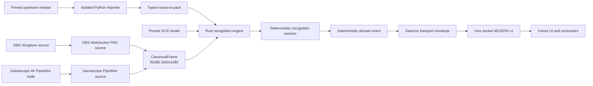

# Architecture

This document is a compact map of the intended system. The accepted delivery
sequence and release gates are authoritative in [the implementation plan](plan.ja.md).

## Data flow



## Stable boundaries

### Frame source

Every backend produces an owned, contiguous `CanonicalFrame` containing RGB8
pixels at exactly 1920x1080, a source generation, a sequence number, monotonic
timing, and immutable profile identifiers.

The two initial sources are deliberately not interchangeable:

- `obs-websocket-fhd-png-v1` is an OBS-rendered screenshot of the game's native
  FHD `vkcapture-source`.
- `gamescope-direct-4k-bgrx-v1` receives the standard Gamescope PipeWire node at
  3840x2160 and applies a fixed 2:1 normalizer.

Each source has its own calibration, fixture set, thresholds, lifecycle tests,
and performance gate. A running session never silently switches profiles.

### Resource adoption

Upstream is an external release input. Inspection first records an exact
tag/commit and file hashes without unpickling. Import is a separate operation
and only accepts bytes that match a pre-existing, human-approved manifest. It
runs the Python importer in a networkless restricted environment.

Generated packs and model files live in a content-addressed external store.
Models, dictionaries, and configs must first match a committed approval record;
runtime auto-download is disabled. An active manifest binds every input and
output digest to the schema, layout, and recognition profiles. It becomes
visible by atomic rename only after replay gates succeed; the runtime verifies
the complete binding before reading it. Only that deterministic,
schema-checked, language-neutral pack reaches Rust.

The runtime never imports upstream Python, reads pickle, or reaches the network.
Imported packs, original resources, and OCR models are generated/private
artifacts rather than repository source.

### Recognition

The engine exposes a pure frame inspection boundary and a separate stateful
session boundary:

```text
RecognitionEngine.inspect(frame) -> RecognitionSnapshot
RecognitionSession.process(snapshot) -> DomainEvent[]
```

Fields are represented as `known`, `unknown(reason)`, or `not_applicable`.
Detected events require every applicable field to be known and cross-field
validation to succeed. Rejection is preferable to a guessed value.

The session output is deterministic for recorded inputs. UUIDv7 IDs and wall
clock delivery timestamps belong to a daemon-owned transport envelope, not the
recognition result compared by replay tests.

### Event API

The first public interface is a same-user Unix socket at
`$XDG_RUNTIME_DIR/scorepeek/events-v1.sock`. It streams versioned NDJSON domain
events, never pixels or stored history. Future UI code must consume this API and
must not import recognizer or upstream internals.

## Ownership

| Concern | Owner |
| --- | --- |
| Game catalog and upstream visual tables | Pinned upstream release input |
| Resource schema adapter | scorepeek importer |
| Capture normalization and thresholds | Versioned scorepeek profiles |
| Recognition and temporal semantics | scorepeek Rust core |
| Public event compatibility | scorepeek schema version |
| Screenshots and calibration corpus | External private store |
| Future UI and persistence | Later scorepeek applications |
