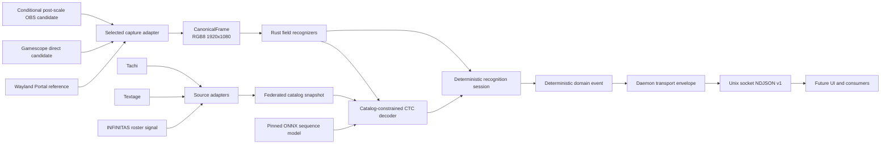

# Architecture

This document is a compact map of the intended system. The accepted delivery
sequence and release gates are authoritative in [the implementation plan](plan.ja.md).

## Data flow



## Stable boundaries

### Frame source

Every backend produces an owned, contiguous `CanonicalFrame` containing RGB8
pixels at exactly 1920x1080, a capture generation, sequence number, monotonic
timing, and immutable capture/normalizer profile identifiers. The supported
profile starts with a post-scale 3840x2160 SDR frame and applies one versioned
2:1 normalization. Native FHD game capture does not satisfy this contract.

Portal is the correctness reference. Gamescope direct PipeWire and a
post-scale OBS path are candidates selected only by target-machine conformance
and performance gates. Each candidate has a distinct profile and a running
session never silently switches sources or mixes generations.

### Layout

`LayoutProfile` contains scorepeek-owned canonical ROIs and feature contracts.
Values are measured from the private capture corpus. An upstream implementation
may inform where to investigate, but its code, coordinates, resources, and
derived data do not enter the profile or its generation process.

### Catalog federation

Source adapters turn immutable Tachi, Textage, and INFINITAS-roster snapshots
into typed observations with source revision, lineage, content digest, parser
version, field authority, and scope. They never execute downloaded JavaScript.

Federation uses exact source bindings and exact, multi-field evidence. It does
not use fuzzy identity merging, weighted majority, or source recency to settle
cross-source conflicts. Ambiguous records are quarantined independently while
safe additions extend the previous catalog. A content-addressed SQLite snapshot
is activated by atomically replacing a small manifest; source failure never
shrinks the last-known-good catalog. Scheduled and manual sync share one
per-host exclusive writer lock. Activation verifies that its base digest is
still current, fsyncs staged files and directories, renames the snapshot, and
fsyncs the content-store destination parent. Only then does it fsync and
atomically replace the active manifest and fsync the manifest parent before
releasing the lock.

The daemon does not synchronize during a game session. It opens one immutable
catalog digest at startup.

### Recognition

The engine exposes pure frame inspection, catalog-constrained title decoding,
and a separate stateful session boundary:

```text
RecognitionEngine.inspect(frame) -> RecognitionSnapshot
TitleDecoder.score(logits, catalog, context) -> AcceptedTitle | Rejected
RecognitionSession.process(snapshot) -> DomainEvent[]
```

Fields are represented as `known`, `unknown(reason)`, or `not_applicable`.
Title OCR emits CTC logits rather than an authoritative free-form string. The
decoder scores exact catalog variants and requires an absolute bound, runner-up
margin, temporal agreement, and screen-specific independent context. Result
uses play mode, difficulty, level, and notes; music select uses play mode,
selected difficulty, and selected level. Version participates only when it is
independently recognized. Detected events require every mandatory field to be
known and cross-field validation to succeed. Rejection is preferable to a guess.

Python is an offline training/export dependency only. The game-session runtime
uses a pinned ONNX model in Rust and has no model or catalog network fallback.
Real captures, training labels, source snapshots, generated catalogs, and model
artifacts remain outside the repository.

The session output is deterministic for recorded inputs. UUIDv7 IDs and wall
clock delivery timestamps belong to a daemon-owned transport envelope, not the
recognition result compared by replay tests.

### Event API

The first public interface is a same-user Unix socket at
`$XDG_RUNTIME_DIR/scorepeek/v1.sock`. It streams versioned NDJSON accepted
domain events, never pixels, OCR candidate text, source snapshots, or stored
history. Future UI code must consume this API and must not import recognizer,
catalog-adapter, or capture internals.

## Ownership

| Concern | Owner |
| --- | --- |
| External source bytes | Each Bazzite host's private cache |
| Catalog identity, federation, and activation | scorepeek catalog core |
| Layout, capture normalization, and thresholds | Versioned scorepeek profiles |
| OCR training corpus and model artifacts | External private store |
| Recognition and temporal semantics | scorepeek Rust core |
| Public event compatibility | scorepeek schema version |
| Future UI and persistence | Later scorepeek applications |
