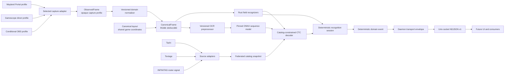

# Architecture

This document is a compact map of the intended system. The accepted delivery
sequence and release gates are authoritative in [the implementation plan](plan.ja.md).

## Data flow



## Stable boundaries

### Frame source

Every backend produces an owned `ObservedFrame` containing its exact input
contract, capture generation, sequence number, monotonic timing, and immutable
opaque capture profile identifier. A versioned domain normalizer maps that
profile to an owned, contiguous RGB8 `CanonicalFrame` at exactly 1920x1080.
The canonical representation is the specified logical game canvas; it has no
required native, Portal, Gamescope, or OBS pixel reference. A capture profile
owns only observed input. Its normalizer artifact maps that profile to one
canonical frame contract. The canonical frame contract owns the shared game
layout; replay evidence references its immutable layout digest separately.

The normalizer treats its capture pipeline as one domain and does not model
Wine, Vulkan, Gamescope, compositor, PipeWire, or other layers separately.
Deterministic geometry, color, and filtering are preferred. A learned residual
adapter must be justified by measured recognition evidence, remain bounded and
deterministic, and never act as a generative text restorer.

Portal, Gamescope direct PipeWire, and an eligible OBS path are peer candidates
selected by independent semantic, lifecycle, and target performance gates.
Each candidate has a distinct capture profile and normalizer but does not own a
layout. A running session never silently switches profiles or mixes generations.

### Layout

One versioned canonical layout contains scorepeek-owned ROIs, presence
predicates, and alignment tolerances in logical game coordinates. Every
supported capture profile must normalize to that layout. The layout changes
only with the game UI geometry, canonical frame contract, or field contract;
capture-route changes create a new profile or normalizer instead. An upstream
implementation may inform where to investigate, but its code, coordinates,
resources, and derived data do not enter the layout or its generation process.

### Catalog federation

Source adapters turn immutable Tachi, Textage, and INFINITAS-roster snapshots
into typed observations with source revision, lineage, content digest, parser
version, field authority, and scope. They never execute downloaded JavaScript.

Federation uses exact source bindings and exact, multi-field evidence. It does
not use fuzzy identity merging, weighted majority, or source recency to settle
cross-source conflicts. Ambiguous records are quarantined independently while
safe additions extend the previous catalog. A content-addressed SQLite snapshot
is activated by atomically replacing a small manifest; source failure never
shrinks the last-known-good catalog. Scheduled and manual sync share one
per-host exclusive writer lock. Activation verifies that its base digest is
still current, fsyncs staged files and directories, renames the snapshot, and
fsyncs the content-store destination parent. Only then does it fsync and
atomically replace the active manifest and fsync the manifest parent before
releasing the lock.

Scheduling is an outer trigger for `scorepeek catalog sync`; it does not encode
how a catalog is acquired. The current implementation builds from validated
source observations on each host. If a later ADR and source permissions allow a
GitHub-managed catalog, the same command can expose a user-selected self-build
or immutable provided-catalog mode, while GitHub scheduling runs the self-build
orchestration before publication. Both modes must retain provenance, bounded
content-addressed storage, semantic validation, and last-known-good activation.

The daemon does not synchronize during a game session. It opens one immutable
catalog digest at startup.

### Recognition

The engine exposes pure frame inspection, catalog-constrained title decoding,
and a separate stateful session boundary:

```text
RecognitionEngine.inspect(frame) -> RecognitionSnapshot
TitleDecoder.score(logits, catalog, context) -> AcceptedTitle | Rejected
RecognitionSession.process(snapshot) -> DomainEvent[]
```

The canonical frame preserves RGB information shared by all field recognizers.
After layout-bound ROI extraction, OCR-specific grayscale, contrast, resize,
padding, and tensor normalization belong to a versioned OCR preprocessor bound
to the model. Training and Rust inference use the same preprocessing contract.

Fields are represented as `known`, `unknown(reason)`, or `not_applicable`.
Title OCR emits CTC logits rather than an authoritative free-form string. The
decoder scores exact catalog variants and requires an absolute bound, runner-up
margin, temporal agreement, and screen-specific independent context. Result
uses play mode, difficulty, level, and notes; music select uses play mode,
selected difficulty, and selected level. Version participates only when it is
independently recognized. Detected events require every mandatory field to be
known and cross-field validation to succeed. Rejection is preferable to a guess.

Python is an offline training/export dependency only. The game-session runtime
uses a pinned ONNX model in Rust and has no model or catalog network fallback.
Real captures, training labels, source snapshots, generated catalogs, and model
artifacts remain outside the repository.

Human-labelled captures from any supported profile may extend an immutable
corpus generation and produce a new normalizer or shared recognizer bundle.
Promotion requires frozen in-profile and cross-profile replay without a
regression; runtime self-labelling, online training, and automatic threshold
relaxation are prohibited.

The session output is deterministic for recorded inputs. UUIDv7 IDs and wall
clock delivery timestamps belong to a daemon-owned transport envelope, not the
recognition result compared by replay tests.

### Event API

The first public interface is a same-user Unix socket at
`$XDG_RUNTIME_DIR/scorepeek/v1.sock`. It streams versioned NDJSON accepted
domain events, never pixels, OCR candidate text, source snapshots, or stored
history. Future UI code must consume this API and must not import recognizer,
catalog-adapter, or capture internals.

## Ownership

| Concern | Owner |
| --- | --- |
| External source bytes | Each Bazzite host's private cache |
| Catalog identity, federation, and activation | scorepeek catalog core |
| Capture normalization and profile-to-contract mapping | Versioned normalizer artifacts |
| Canonical game coordinates and shared layout | Versioned canonical frame contract |
| OCR preprocessing, model artifacts, and thresholds | Versioned scorepeek model bundles |
| OCR training corpus and model artifacts | External private store |
| Recognition and temporal semantics | scorepeek Rust core |
| Public event compatibility | scorepeek schema version |
| Future UI and persistence | Later scorepeek applications |
