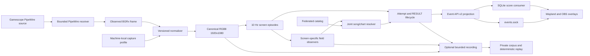

# Architecture

This document maps the current system, its data flow, and authority boundaries.
Detailed contracts live in the linked domain references and in the typed source
and tests that implement them.

## Data flow

## Runtime boundary

The ordinary game-session process is Rust. It loads one active catalog, the
registered PP-OCRv6-small text bundle, the installed private numeric bundle,
and one capture profile before admitting recognition work. Python is restricted
to reproducible offline OCR preparation, training, and export tooling.

The runtime does not start, stop, signal, or restart the operator's ordinary
Gamescope, Steam, or game processes. It waits for exactly one eligible
Gamescope video source, treats each source lifetime as a distinct capture
generation, and performs bounded ordered teardown on source loss or process
termination.

## Capture and canonical frame

Gamescope direct PipeWire is the current capture route. Source acquisition and
frame reception are separate owners. The receiver returns producer buffers
promptly, retains only the newest application-owned frame, and samples it at
the independent 10 Hz recognition cadence.

A machine-local profile contains the observed BGRx dimensions, a measured
axis-aligned source rectangle, and the normalizer identity. It is created by
`scorepeek setup gamescope` from the scorepeek-owned marker. Runtime
admission validates the actual format, dimensions, byte layout, and saved
geometry. It never remeasures geometry, changes profiles, relaxes thresholds,
or falls back to another capture route during a session.

Only the selected profile normalizer may create a contiguous canonical RGB8
1920x1080 frame. Capture generation, profile, normalizer, layout, catalog, and
model identities remain bound through recognition and diagnostics.

## Recognition and temporal authority

The screen classifier creates typed MUSIC SELECT, MODE SELECT,
DECIDE/transition, PLAY, RESULT, or UNKNOWN observations. Semantic screen
episodes control suspension, drain, and finalization. UNKNOWN never supplies
field crops.

Screen-specific observers use scorepeek-owned layouts and registered model
bundles. Text recognition and specialist numeric recognition run in bounded
workers; one failed required field makes the whole screen observation fail
closed. Full-catalog song and chart resolution keeps title, artist, play type,
difficulty, level, and notes as independently attributable evidence. Ambiguity,
conflict, insufficient margin, or missing required evidence produces a typed
unknown rather than a guess.

MUSIC SELECT identity, supplemental self-best values, RESULT recognition, and
play-attempt resolution have separate state. Supplemental best values never
become song-identity or attempt-acceptance evidence. Current field
applicability and acceptance rules are defined in
[field semantics](field-semantics.md).

## Events and score persistence

The public live interface is Event API v2 on
`$XDG_RUNTIME_DIR/scorepeek/events.sock`. A client receives one current
snapshot and then ordered NDJSON events. The public projection excludes raw
OCR, candidates, recognition metrics, recording paths, pixels, and stored
history. Reconnection restores current state, not every missed event. The wire
contract and RESULT lifecycle are defined in [Event API v2](event-api.md).

The in-process `scorepeek-scores` consumer persists provisional, retracted,
and confirmed RESULT transitions plus current MUSIC SELECT supplements in
SQLite. Persistence is independent of socket clients and optional recording.
Overlays query committed SQLite state for score/history presentation; they do
not treat a live RESULT payload as committed history.

## Overlay boundary

Wayland and OBS are independent consumers of the same public event and SQLite
state. They share the Dioxus editor model, semantic presentation, installable
skin ABI, and canvas/widget document. Backend adapters own only transport,
surface lifecycle, input normalization, and rendering differences.

Each installed skin is a self-contained ZIP with manifest, Wasm DOM producer,
CSS, preview, and package-relative resources. Native executes the Wasm module
through Wasmtime; OBS executes it in a Web Worker. The current authoring
contract is [skin plugin API v1](skin-plugin-api-v1.md).

Browser integration, fake Wayland, and the checked-in nested compositor
scenario are the routine overlay completion gates. Real OBS or a live
compositor is used when an adapter-specific failure needs investigation, not as
a standing gate for every editor or skin change. The reproducible procedures
are in [overlay visual debugging](overlay-visual-debugging.md).

## Diagnostics and private corpus

Every `run` writes one invocation-level structured diagnostic stream without changing recognition
or event authority. `--record` adds canonical video only. The separate live socket, 128 MiB ring,
disk degradation, and ten-generation policy are defined in [runtime diagnostics](diagnostics.md).

The private corpus imports complete operator-reviewed sessions, retains
metadata locally, optionally stores canonical Matroska segments in a configured
S3-compatible object store, and replays through the production recognition and
temporal path. Real frames, complete labels, generated catalogs, model bytes,
player data, and credentials stay outside Git. See
[private corpus](private-corpus.md) and
[recording simulation](recording-simulation.md).

## Ownership

| Concern | Current owner |
| --- | --- |
| External catalog bytes | Private source cache on each operator host |
| Catalog parsing, federation, quarantine, activation | `scorepeek::catalog` |
| Gamescope source lifetime and frame reception | Capture provider and receiver |
| Profile geometry and canonical normalization | Versioned profile and normalizer |
| Canonical game coordinates | Versioned layout resources in `crates/scorepeek/src` |
| OCR preprocessing, models, and thresholds | Registered text and numeric bundles |
| Screen, song/chart, and attempt semantics | Recognition and temporal Rust modules |
| Public live compatibility | Event API v2 typed projection |
| Durable local score state | `scorepeek-scores` SQLite consumer |
| Canvas/editor state and skin execution | Overlay crates and skin SDK |
| Private replay evidence | Diagnostic store and external private corpus |

Git history owns superseded designs, experiments, rejected alternatives, and
point-in-time verification results. They are not additional runtime or design
authorities.
